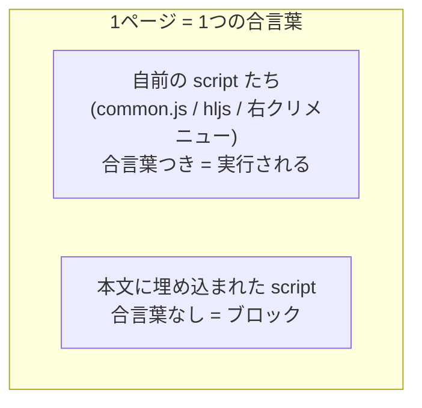
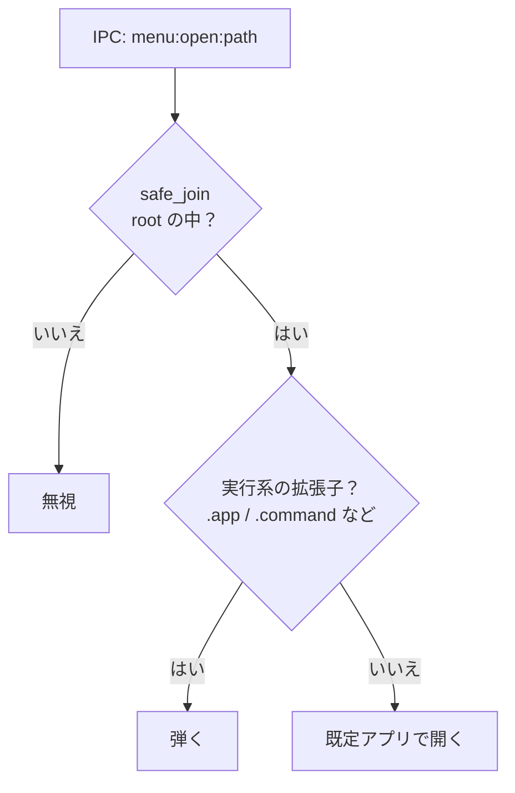
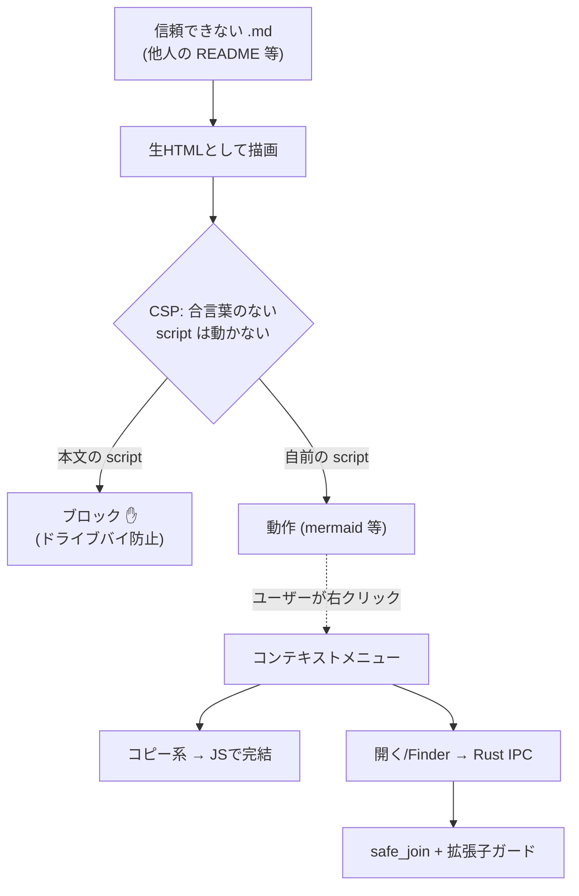

# md-preview のセキュリティモデル — やさしい解説

このドキュメントは、右クリックメニュー（相対/絶対パスのコピー・Finder表示・開く）を
追加するにあたって入れた**セキュリティの仕組み**を、後から読んでも分かるように
かみくだいて説明するものです。

> [!NOTE]
> ひとことで言うと:
> **「他人の書いた Markdown を開いても、勝手にコードが動いたりファイルが起動したりしない」**
> ようにするための設計です。鍵は **CSP** と **メニューIPCの作り方** の2つ。

---

## 1. 何が問題だったのか

md-preview は Markdown を **生（なま）の HTML としてそのまま描画**します。
これは「Markdown の中に `<div>` や ``、表組みなどの HTML を直接書ける」ようにする
ための、意図した仕様です（mermaid / draw.io もこの仕組みに乗っています）。

ところが「生 HTML をそのまま描画する」ということは、こういう Markdown も**そのまま動いて
しまう**ということです:

```markdown
ふつうの README に見えるけど…

<script>
  // ページに埋め込まれた JavaScript はそのまま実行される
  doSomethingNasty();
</script>


```

自分で書いた Markdown だけを開くなら問題になりません。
でも **他人の README やネットで拾った `.md` を開く**なら、その中の `<script>` は
「信頼できないコード」です。これが出発点。

---

## 2. なぜ右クリックメニューで話がややこしくなるのか

今回メニューに「Finderで表示」「デフォルトアプリで開く」を足しました。
これらは内部的に、画面（webview）から Rust 側へ**メッセージ（IPC）**を送って実現します。

```
JS:   window.ipc.postMessage("menu:open:README.md")
Rust: → そのファイルを `open` で起動する
```

問題は、**この `postMessage` は右クリックしなくても、ページ内の JavaScript なら誰でも
呼べる**こと。つまり 1. の悪意ある `<script>` が動ける状態だと:


これを **ドライブバイ**（こちらが何も操作していないのに発火する）と呼びます。
「メニューを開いたときだけ動く」という前提が崩れるのがポイントです。

> [!IMPORTANT]
> だから対策の本丸は「メニューの作り方」ではなく、
> **そもそも本文中の `<script>` を動かさないこと**になります。

---

## 3. 防御その1: CSP（本文スクリプトを動かさない）

**CSP = Content-Security-Policy**。ブラウザ（webview）に対して
「このページで動かしていい JavaScript はこれだけ」と宣言する仕組みです。
VS Code の Markdown プレビューも同じ考え方で守っています。

md-preview が入れている宣言（抜粋）:

```
script-src 'self' 'unsafe-eval' 'nonce-<毎回変わるランダム値>'
```

意味はこうです:

- `'self'` … 同じ場所（`mdpreview://localhost/__lib/…`）から読むスクリプトはOK
  → mermaid / draw.io のライブラリはここに該当するので動く。
- `'nonce-…'` … **その nonce（合言葉）が付いた `<script>` だけ実行してよい**。
- それ以外の `<script>`（＝本文に埋め込まれたもの）は**実行されない**。
- `'unsafe-inline'` を**あえて入れない**のがキモ。これを入れると本文 script も
  動いてしまうので、入れない。

### nonce（合言葉）の仕掛け



「合言葉を盗んで自分の script に付ければいいのでは？」と思うかもしれませんが、**できません**:

1. ブラウザは nonce 属性を JS から読めないよう隠す。
2. そもそも合言葉を知るには script を動かす必要があるのに、その script は
   合言葉が無いと動かない（**ニワトリと卵**）。

`.md` は静的なファイルで、開かれるたびに変わる合言葉を事前に書いておくことは不可能。
だから本文 script は確実に止まります。

> [!TIP]
> `'unsafe-eval'` は mermaid/draw.io の保険として入れていますが、
> 「合言葉付きで動いている自前 script の中で eval してよい」だけの許可です。
> 攻撃者の script はそもそも動けないので、eval にたどり着けません。安全です。

これで **2. のドライブバイの根が断たれる**ため、「開く」「Finder表示」に
毎回の確認ダイアログを挟む必要がなくなりました。

---

## 4. 防御その2: メニューIPCの作り方

CSP だけに頼らず、メニュー側も**攻撃の手数を最小化**しています。

### (a) 安全な操作は JS で完結させ、IPC を使わない

| 操作 | どこで処理 | 理由 |
|---|---|---|
| 選択テキストをコピー | JS（`navigator.clipboard`） | クリップボードに書くだけ。Rustに送る必要なし |
| 相対パスをコピー | JS（`navigator.clipboard`） | 同上。文字列をコピーするだけ |
| **絶対パスをコピー** | Rust（IPC） | 絶対パスは root の場所を知る Rust 側でないと作れない |
| **Finderで表示** | Rust（IPC） | ファイル操作なので Rust |
| **デフォルトアプリで開く** | Rust（IPC） | 同上 |

→ Rust に届く IPC は `abs` / `reveal` / `open` の **3つだけ**。攻撃面が小さい。

### (b) パスは必ず「開いているフォルダの中」に閉じ込める

Rust 側は受け取った相対パスを `safe_join` で解決します。これは:

- `..` で上のディレクトリへ抜けるのを拒否
- シンボリックリンクで外を指していても、実体が root の外なら拒否
- 絶対パス（`/etc/passwd` など）を渡されても root 外なら拒否

つまり**開いているフォルダの外のファイルは触れません**。

### (c) 「開く」は実行系の拡張子を弾く（多層防御）

CSP で本文 script は止まっていますが、念のため `open` で**起動・遷移してしまう型**
（`.app` `.command` `.terminal` `.workflow` `.scpt` `.webloc` `.url` など）は拒否します。
`.md` や `.txt` のような「開いてもエディタで表示されるだけ」の型は通します。



---

## 5. 全体像



---

## 6. 残るリスクと割り切り

完璧な隔離ではありません。現実的な範囲での割り切りも明記しておきます。

- **生 HTML 自体は描画し続ける**（サニタイズはしていない）。
  `<script>` は CSP で止まりますが、CSS による見た目の細工や、リモート画像の
  読み込み（`img-src` で http/https を許可）などは可能です。実害は小さいと判断。
- **クリップボード汚染**は理論上可能（コピーした文字列に細工）。パスは root 内に
  限定済みで、影響は限定的。
- nonce は時刻由来で生成しており暗号学的乱数ではありませんが、上記「ニワトリと卵」に
  より静的な攻撃ファイルからは突破できないため、この用途では十分です。

> [!NOTE]
> もっと厳しくしたい場合の次の一手は **HTML サニタイズ**（`<script>` や `on*=` 属性を
> 描画前に除去する）です。ただし mermaid/draw.io や意図した HTML 埋め込みへの影響確認が
> 必要になるため、今回は CSP による防御を採用しています。

---

## 関連する実装

| ファイル | 役割 |
|---|---|
| `src/html.rs` | CSP メタタグの埋め込み・nonce 生成（`make_nonce`） |
| `src/contextmenu.js` | 右クリックメニュー本体。コピー系はJS完結 |
| `src/main.rs` | `handle_menu` / `resolve_target` / `is_blocked_ext`（IPC処理とガード） |
| `src/request.rs` | `safe_join`（パスを root 内に限定） |
| `src/platform.rs` | クリップボード書き込み・Finder表示・開く（macOS） |
