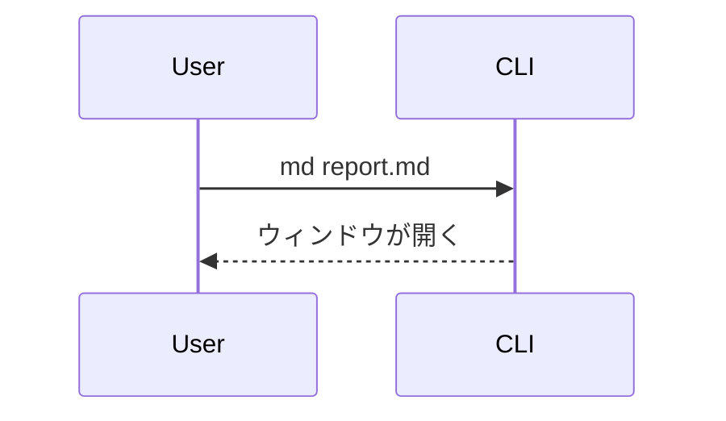

# md-preview チートシート

`md` コマンドで起動する macOS 向けの Markdown ビューア。GitHub 風スタイルで WebKit ウィンドウに描画する。人に Markdown や HTML を見せたいとき・自分でレンダリング結果を確認したいときに使う。

主な機能: 検索（⌘F）・ファイル検索（⌘P。フォルダモード限定）・アウトライン（⌘T）・git 差分（⌘D）・raw ソース表示（⌘R）・本文へのコメント（`c`）・Mermaid / draw.io 図・テーマ・`.html` の iframe 描画・非 md ファイルのソースビュー。図のライブラリは図がある時だけ遅延ロードされるので通常の Markdown は軽いまま開ける。**キーボードだけで読み歩け**、フォルダを開けばファイルツリーから複数ファイルを行き来できる。`?` でショートカット一覧が出る。

## 開き方

`md` は GUI ウィンドウを開き、閉じるまでブロックする。必ずバックグラウンドで起動する。

```bash
md path/to/document.md &
```

表示モードは開くパスで決まる:

- カレントディレクトリ内のファイル → フォルダモード（ディレクトリツリーのサイドバー付き）
- カレントディレクトリ外のファイル（一時ディレクトリなど） → 単一ファイルモード（サイドバーなし）
- ディレクトリ（`md .` / `md docs/`） → そこをルートにしたフォルダモード

## 主なコマンド

```bash
md <file.md|ディレクトリ>   # ファイルかディレクトリを開く
cat file.md | md            # 標準入力（パイプ）から読む
md theme [<名前>]           # テーマ一覧の表示 / 切り替え
```

その他のオプション（`--sample`、`--version` など）は `md --help` を参照。

## Markdown 以外（HTML / ソースファイル）

`md` は `.md` 専用ではない。**HTML を書いてユーザーに見せるときも、「ブラウザで開いてね」と言う必要はなく `md` でそのまま渡せる**。

```bash
md report.html &     # iframe でレンダリング表示（CSS も JS も効く）
md src/main.rs &     # 行番号つきソースビュー
```

- `.html` / `.htm` → iframe でそのままレンダリングされる（ミニブラウザ方式）。⌘R で生ソース表示に切り替えられる。
- それ以外の拡張子 → VSCode 風のソースビュー（行番号ガター＋構文ハイライト）。
- html 表示中もスクロール素キー・`?`・ファイル移動（`]` / `[` / `Tab`）は効く。ただし ⌘F 検索とアウトラインは iframe の**中身**には効かない（⌘R でソースにすれば検索できる）。コメント（`c`）も html 表示中は使えない。

## 記法リファレンス

GFM（テーブル、タスクリスト、打ち消し線、脚注、シンタックスハイライト付きコード）に対応。加えて以下を描画する。

### リンク

| 書き方 | 結果 |
|---|---|
| `<https://example.com>` | ✅ クリックできる（**推奨**） |
| `[表示文字](https://example.com)` | ✅ クリックできる |
| `https://example.com`（裸のURL） | ❌ ただのテキスト |
| `[[https://example.com]]` | ✅ クリックできる（WikiLink） |
| `[[https://example.com\|表示名]]` | ✅ 別名リンク（`\|` で表示文字を指定） |
| コードブロック / インラインコードの中の URL | ❌ ただのテキスト（山カッコで囲んでも同じ） |

URL をそのまま貼るときは `<https://example.com>` のように **山カッコで囲む**のがおすすめ。裸のURLは自動リンク化されないので、そのままだと飛べない。`http`/`https` のリンクはクリックでデフォルトブラウザが開く。同じディレクトリ内の相対リンク（`[次へ](./other.md)`）はプレビューペイン内で遷移する。ファイルパスやスキーム無しの文字列はリンクにならない。

> [!IMPORTANT]
> 山カッコで囲んだ URL でも、コードブロックやインラインコード（バッククォート）の中に入れるとリンクにならない。コード内では Markdown の記法が解釈されず、山カッコごと文字として表示されるだけ。**踏ませたい URL は地の文に書く**。コードブロックはコピペさせたいコマンドやソース用で、リンクとは用途が違う。

`[[...]]` の WikiLink 記法も使える。`[[https://example.com]]` や `[[https://example.com|表示名]]` のように URL を入れるとリンクになる。中身がページ名（`[[SomePage]]`）の場合はそのまま相対パスへのリンクになるため、実在するパスでないと遷移先は開けない。

### テーブル

幅が広いテーブルの場合は横スクロール可能だが、各行を `### 見出し＋「列名: 値」` の箇条書きへ展開して、列の意味を保ったままスクロール不要にすると読みやすい。

### GFMアラート

アイコンつきの色分けコールアウトボックスになる。5種類は重大度順:

| 記法 | 用途 |
|---|---|
| `> [!NOTE]` | 軽い補足 |
| `> [!TIP]` | ちょっとした近道 |
| `> [!IMPORTANT]` | 頭に入れておくべきこと |
| `> [!WARNING]` | 間違えると実害が出る |
| `> [!CAUTION]` | データ損失など危険な操作 |

```markdown
> [!WARNING]
> これはテーブルを削除する。先にバックアップを取ること。
```

### Mermaid図

```` ```mermaid ```` のフェンスブロック。フローチャート、シーケンス図などに対応。遅延ロードなので、図のないドキュメントは軽いまま。

````markdown

````

### draw.io図

`<mxGraphModel>` または `<mxfile>` の XML を含む ```` ```drawio ```` ブロック。図をクリックすると全画面表示になり、ズーム・パンできる。Mermaid / draw.io のライブラリは図が含まれるときだけ遅延ロードされる。

### アコーディオン（折りたたみ）

標準の `<details>` / `<summary>` タグがそのまま使える。クリックで開閉する折りたたみUIになる。`</summary>` の後に**空行を1行**入れると、中身が通常のマークダウンとして解釈される。`<details open>` で初期状態を開いた状態にできる。

```markdown
<details>
<summary>クリックで開く見出し</summary>

ここに本文。**マークダウン**やリスト、コードブロックも書ける。

</details>
```

### ファイル名つきコードブロック

言語の後にパスを付けると、ブロックの上にファイル名ヘッダが描画される。

````markdown
```rust:src/main.rs
fn main() {}
```
````

### ファイルリンクのコード埋め込み

ローカルファイルへのリンクを**段落に単独で**置くと、そのファイルの中身がシンタックスハイライト付きのコードブロックとして展開される（GitHub のパーマリンク埋め込みのローカル版）。パスは、その md ファイルがある場所を基準に解決する。

| 書き方 | 結果 |
|---|---|
| `[main](./src/main.rs#L10-L20)` | ✅ 10〜20行目を展開 |
| `[open](./src/main.rs#L5)` | ✅ 5行目だけ展開 |
| `[lib](./src/lib.rs)` | ✅ ファイル全体を展開 |
| 本文中の `[main](./src/main.rs)` | ❌ 普通のリンクのまま |
| `[GitHub](https://github.com/)` | ❌ 普通のリンク（外部URLは対象外） |
| `[節へ](#見出し)` | ❌ 普通のリンク（アンカーは対象外） |
| `[次へ](./other.md)` | ❌ ペイン内遷移リンクのまま（後述） |
| `[次へ](./other.md#L2-L8)` | ✅ 行範囲を明示すれば md でも展開 |

ヘッダの左にパス、右に行範囲が出る。読めないファイル・存在しないパス・バイナリ・行範囲がファイル外の場合は展開せず、普通のリンクとして残る。

**100 行を超える埋め込みは畳まれて先頭 40 行だけ表示**され、下端の「すべて表示（N 行）」バーで開閉できる。**1000 行がハード上限**で、範囲を明示していてもそこで打ち切り、ヘッダに `L1-L1000 / 全 1500 行` のように総行数を出す。1000 行を超えるような引用は、埋め込むよりリンクで飛ばした方が読みやすい。

`.md` / `.html` への**範囲なし**のリンクは、プレビューペイン内で遷移するナビゲーション（`[次へ](./other.md)`）として既に意味を持つので埋め込まない。これらを展開したいときは `#L2-L8` のように行範囲を付ける。

コードブロックや表と同じくブロック単位でコメント（`c`）を付けられる。展開されるのは描画した時点のスナップショットなので、埋め込み元のファイルだけを書き換えても自動リロードは走らない（md ファイル側を保存し直すと反映される）。

### フロントマター

先頭の `--- key: value ---` ブロックが、上部に小さなメタ情報テーブルとして描画される（title、author、date など）。`key: value` を1行1つで書く。完全な YAML ではなく、ネスト構造は描画されない。

## もっと詳しく（references/）

- [references/navigation.md](references/navigation.md) — キーボード操作（スクロール素キー・フォルダ内のファイル移動とツリー操作）、検索 / アウトライン / diff / raw の各機能、`.html` の iframe 描画と非 md のソースビュー
- [references/comment.md](references/comment.md) — 本文へのコメント機能（`c`）の詳しい操作
