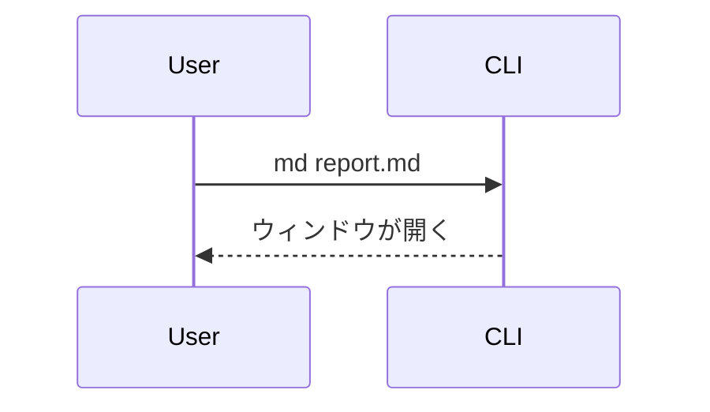

# md-preview チートシート

`md` コマンドで起動する macOS 向けの Markdown ビューア。GitHub 風の Markdown を WebKit ウィンドウで描画する。テーマ、検索（⌘F）、アウトライン（見出しナビ。ウィンドウが十分広く見出しが 3 つ以上あれば右サイドバーに自動表示。⌘T で開閉、狭い画面では自動で退避）、git 差分表示（⌘D。右下のトグルでも切替可。VSCode 風のインラインソース差分で `git diff HEAD` を表示。行＋行内文字単位で強調、全ファイル対応、モードとして維持。トグルに変更行数 `+N −M` バッジ）、raw（ソース）表示（⌘R。右下のトグルでも切替可。レンダリング前の生ソースを構文ハイライト付きで表示。通常表示がレンダリング結果になる `.md` 系・`.html` 系ファイルで有効で、diff とは排他。その他のファイルは通常表示が既にソースなので raw トグルは出ない）、遅延ロードの図に対応している。`?` キー（または右クリックメニュー）でキーボードショートカット一覧のオーバーレイを表示できる。

キーボードだけで読み歩ける。スクロールは less/vim 流の素キー（`j`/`k` 行、`d`/`u` 半ページ、`Space`/`Shift+Space` ページ、`g`/`G` 冒頭末尾）で全モード共通、`/` で検索を開く。フォルダを開いているときは `]`/`[` で表示中のファイルを次/前へ巡回、`Tab` で本文とファイルツリーのフォーカスを切替、ツリー内では `j`/`k` 移動・`g`/`G` 端・`Enter`/`l` で開く&フォルダ展開・`h` で畳む/親へ。`[`/`]`・`Tab` は html の iframe にフォーカスがあっても効く。

`.html` / `.htm` ファイルを開くと、**iframe でそのままレンダリング表示**される（CSS も JavaScript も効く、ミニブラウザ方式）。⌘R（右下トグル）で生ソース表示に切り替えられる。手元のローカルファイル閲覧用途のため sandbox は付けていない。iframe 内で描画されるので、⌘F 検索・アウトライン（TOC）は html の中身には効かない（ソース表示に切り替えれば検索できる）。⌘R/⌘D などアプリのショートカットは iframe にフォーカスがあっても効く。

`.md`・`.html` 以外のファイルを開くと、VSCode 風の**全幅ソースビュー**（行番号ガター＋ファイル名バー付き、構文ハイライト）で表示される。レンダリング済み Markdown は 720px 中央寄せ、html は iframe 全面、ソース／raw／diff は全幅、という統一レイアウト。

`c` キーで**コメントモード**に入ると、レンダリング済み本文の見出し・段落・リスト項目・表・引用・コードブロックにその場でコメントを付けられる（クリックで 1 ユニット、ドラッグで複数行レンジ、`⌘+Enter` で保存 / `Esc` で取消）。**マウス無しでも操作可能**で、モード中は `j`/`k`（`↑`/`↓`）でユニット間を移動、`Shift+j`/`Shift+k` でレンジ選択、`Enter` でコメント入力を開く。付けたコメントは右下パネルにたまり、「全部コピー」で `- file:line` ＋引用＋コメントの形式に畳んでクリップボードへ入る。そのまま Claude Code に貼れば、ファイルと行を指したレビュー指摘になる（difit のコメント→AI に渡す体験の Markdown 版）。フォルダモードでは別ファイルへ移ってもパネルに蓄積され続ける。対象は Markdown 本文のみ。

## 開き方

`md` は GUI ウィンドウを開き、閉じるまでブロックする。必ずバックグラウンドで起動する。

```bash
md path/to/document.md &
```

表示モードは開くパスで決まる:

- カレントディレクトリ内のファイル → フォルダモード（ディレクトリツリーのサイドバー付き）
- カレントディレクトリ外のファイル（一時ディレクトリなど） → 単一ファイルモード（サイドバーなし）
- ディレクトリ（`md .` / `md docs/`） → そこをルートにしたフォルダモード

本文の幅は、レンダリング済み Markdown が 720px 中央寄せ、ソースビュー／raw／diff は全幅（左寄せ）。

## 主なコマンド

```bash
md <file.md|ディレクトリ>   # ファイルかディレクトリを開く
cat file.md | md            # 標準入力（パイプ）から読む
md theme [<名前>]           # テーマ一覧の表示 / 切り替え
```

その他のオプション（`--sample`、`--version` など）は `md --help` を参照。

## 記法リファレンス

GFM（テーブル、タスクリスト、打ち消し線、脚注、シンタックスハイライト付きコード）に対応。加えて以下を描画する。

### リンク

| 書き方 | 結果 |
|---|---|
| `<https://example.com>` | ✅ クリックできる（**推奨**） |
| `[表示文字](https://example.com)` | ✅ クリックできる |
| `https://example.com`（裸のURL） | ❌ ただのテキスト |
| `[[https://example.com]]` | ✅ クリックできる（WikiLink） |
| `[[https://example.com\|表示名]]` | ✅ 別名リンク（`\|` で表示文字を指定） |

URL をそのまま貼るときは `<https://example.com>` のように **山カッコで囲む**のがおすすめ。裸のURLは自動リンク化されないので、そのままだと飛べない。`http`/`https` のリンクはクリックでデフォルトブラウザが開く。同じディレクトリ内の相対リンク（`[次へ](./other.md)`）はプレビューペイン内で遷移する。ファイルパスやスキーム無しの文字列はリンクにならない。

`[[...]]` の WikiLink 記法も使える。`[[https://example.com]]` や `[[https://example.com|表示名]]` のように URL を入れるとリンクになる。中身がページ名（`[[SomePage]]`）の場合はそのまま相対パスへのリンクになるため、実在するパスでないと遷移先は開けない。

## テーブル

幅が広いテーブルの場合は横スクロール可能だが、各行を`### 見出し＋「列名: 値」`の箇条書きへ展開して、列の意味を保ったままスクロール不要にすると読みやすい。

### GFMアラート

アイコンつきの色分けコールアウトボックスになる。5種類は重大度順:

| 記法 | 用途 |
|---|---|
| `> [!NOTE]` | 軽い補足 |
| `> [!TIP]` | ちょっとした近道 |
| `> [!IMPORTANT]` | 頭に入れておくべきこと |
| `> [!WARNING]` | 間違えると実害が出る |
| `> [!CAUTION]` | データ損失など危険な操作 |

```markdown
> [!WARNING]
> これはテーブルを削除する。先にバックアップを取ること。
```

### Mermaid図

```` ```mermaid ```` のフェンスブロック。フローチャート、シーケンス図などに対応。遅延ロードなので、図のないドキュメントは軽いまま。

````markdown

````

### draw.io図

`<mxGraphModel>` または `<mxfile>` の XML を含む ```` ```drawio ```` ブロック。

### アコーディオン（折りたたみ）

標準の `<details>` / `<summary>` タグがそのまま使える。クリックで開閉する折りたたみUIになる。`</summary>` の後に**空行を1行**入れると、中身が通常のマークダウンとして解釈される。`<details open>` で初期状態を開いた状態にできる。

```markdown
<details>
<summary>クリックで開く見出し</summary>

ここに本文。**マークダウン**やリスト、コードブロックも書ける。

</details>
```

### ファイル名つきコードブロック

言語の後にパスを付けると、ブロックの上にファイル名ヘッダが描画される。

````markdown
```rust:src/main.rs
fn main() {}
```
````

### フロントマター

先頭の `--- key: value ---` ブロックが、上部に小さなメタ情報テーブルとして描画される（title、author、date など）。`key: value` を1行1つで書く。完全な YAML ではなく、ネスト構造は描画されない。
