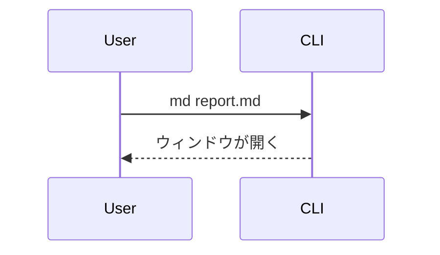

# md-preview チートシート

`md` コマンドで起動する macOS 向けの Markdown ビューア。GitHub 風スタイルで WebKit ウィンドウに描画する。人に Markdown や HTML を見せたいとき・自分でレンダリング結果を確認したいときに使う。

主な機能: 検索（⌘F。もう一度押すと閉じる）・フルスクリーン（⌃⌘F）・ファイル検索（⌘P。未入力なら git で変更のあるファイルが先頭）・アウトライン（⌘T）・git 差分（⌘D）・raw ソース表示（⌘R）・本文へのコメント（`c`）・選択即コピー（なぞるだけでクリップボードに入る）・Mermaid / draw.io 図・テーマ・`.html` の iframe 描画・非 md ファイルのソースビュー。図のライブラリは図がある時だけ遅延ロードされるので通常の Markdown は軽いまま開ける。**キーボードだけで読み歩け**、ファイルツリーとタブ（⇧Tab で次のタブへ・⌘W で閉じる）で複数ファイルを行き来できる（⌘B でツリーを畳んで本文を広げられる）。`?` でショートカット一覧が出る。

## 開き方

```bash
md path/to/document.md
md a.md b.md c.md    # 複数書いたときはまとめて渡す（タブで並ぶ）
```

**書いたファイルが複数あるなら 1 つずつ開かせず、まとめて 1 回の `md` に渡す。** 指定した順にタブが並び、先頭が最初に表示される。ユーザーは ⇧Tab で次のタブへ移れる（`md` を複数回叩くとウィンドウが増えるだけで、行き来しづらくなる）。

末尾の `&` は不要。標準出力が端末でないとき（エージェントからのコマンド実行はこれに当たる）、`md` は自分をバックグラウンドへ切り離して即座に終了する。呼び出し元がコマンドの待ち時間の上限に達してプロセスグループを畳んでも、ウィンドウは残る。

人がターミナルから叩いたときは、ウィンドウを閉じるまで終了しない（Ctrl-C で閉じられる）。この判定は `--detach` / `--no-detach` で上書きできる。

画面はどの開き方でも同じ（ディレクトリツリーのサイドバー＋タブ＋プレビュー）。開くパスで決まるのはルートの位置だけ:

- ディレクトリ（`md .` / `md docs/`） → そこがルート。タブは開かない
- カレントディレクトリ内のファイル → カレントディレクトリがルート
- カレントディレクトリ外のファイル（一時ディレクトリなど） → 渡したファイルたちの共通の親がルート（1 つならその親ディレクトリ）
- パイプ（`cat file.md | md`） → カレントディレクトリがルート。渡した内容は一時ファイルに書き出され、ルートの外のファイルとしてタブで開く（ツリーには出ない）

ディレクトリは複数指定に混ぜられない（ツリーは 1 本）。

## 主なコマンド

```bash
md <file.md|ディレクトリ>   # ファイルかディレクトリを開く
md <a.md> <b.md> …          # 複数ファイルをタブで開く
cat file.md | md            # 標準入力（パイプ）から読む
md theme [<名前>]           # テーマ一覧の表示 / 切り替え
```

その他のオプション（`--sample`、`--version` など）は `md --help` を参照。

## Markdown 以外（HTML / ソースファイル）

`md` は `.md` 専用ではない。**HTML を書いてユーザーに見せるときも、「ブラウザで開いてね」と言う必要はなく `md` でそのまま渡せる**。

```bash
md report.html       # iframe でレンダリング表示（CSS も JS も効く）
md src/main.rs       # 行番号つきソースビュー
```

- `.html` / `.htm` → iframe でそのままレンダリングされる（ミニブラウザ方式）。⌘R で生ソース表示に切り替えられる。中の JavaScript は sandbox なしで実行されるので、自分が書いた HTML を見せるのは問題ないが、出所の分からない `.html` を開かせるのは避ける。
- それ以外の拡張子 → VSCode 風のソースビュー（行番号ガター＋構文ハイライト）。
- コメント（`c`）は raw ソース表示（⌘R）と非 md ファイルのソースビューでも使える（1 行が 1 ユニット。行番号はプレビューと同じソース行なので、一覧では両方のコメントが混ざって並ぶ。本文への印は付けた表示にだけ出る）。`.html` の iframe 表示と git 差分（⌘D）には行コメントを付けられない（モードには入れて、巡回・全部コピー・全消去は使える。`j` / `k` は本文スクロールのまま）。モード中はコメントが対象ブロックの直下にも GitHub 風に埋め込み表示される（raw / ソースビューでも行の直下に出る。1 万行を超えるソースは行コメント不可でサイドバー一覧のみ）。
- html 表示中もスクロール素キー・`?`・ファイル移動（`]` / `[` / `Tab`）・⌘F 検索は効く（検索は iframe の中身も対象。ただし cross-origin へ遷移した iframe と shadow DOM の中は除く）。素キーの `/` は iframe にフォーカスがあるときは効かない（⌘F を使う）。アウトラインは iframe の**中身**には効かない。コメント（`c`）は html 表示中は行に付けられない（一覧の巡回だけ使える）。

## 記法リファレンス

GFM（テーブル、タスクリスト、打ち消し線、脚注、シンタックスハイライト付きコード）に対応。加えて以下を描画する。

### リンク

| 書き方 | 結果 |
|---|---|
| `https://example.com`（裸のURL） | ✅ クリックできる（自動リンク化） |
| `<https://example.com>` | ✅ クリックできる（GitHub 互換の書き方） |
| `[表示文字](https://example.com)` | ✅ クリックできる |
| `[[https://example.com]]` | ✅ クリックできる（WikiLink） |
| `[[https://example.com\|表示名]]` | ✅ 別名リンク（`\|` で表示文字を指定） |
| コードブロック / インラインコードの中の URL | ❌ ただのテキスト（山カッコで囲んでも同じ） |

裸の URL はそのまま貼るだけでリンクになる（GitHub と同じ挙動）。山カッコで囲む必要はない。`http`/`https` のリンクはクリックでデフォルトブラウザが開く。相対リンク（`[次へ](./other.md)`）はプレビューペイン内で遷移する。相対パスの基準は開いているフォルダではなく**そのファイルがある場所**なので、サブフォルダや上位フォルダ（`../other/x.md`）を指してもよい。画像（``）も同じ基準で解決する。ファイルパスやスキーム無しの文字列はリンクにならない。

**裸 URL がどこまでリンクになるか**

| 書き方 | 結果 |
|---|---|
| `詳細はhttps://example.com/aを参照。` | ✅ `https://example.com/a` だけがリンク（前後の日本語は地の文のまま） |
| `（https://example.com/a）` | ✅ 全角括弧は URL に入らない |
| `https://example.com/a。` `…/a.` `…/a,` | ✅ 末尾の句読点は URL に入らない |
| `(https://example.com/a)` | ✅ 対応の取れていない閉じ括弧は外す |
| `https://ja.wikipedia.org/wiki/Foo_(bar)` | ✅ 対応の取れた括弧は URL に含む |
| `https://ja.wikipedia.org/wiki/ずんだもん` | ⚠️ `/wiki/` までで切れる |
| `www.example.com` / `foo@example.com` | ❌ リンクにならない（対象は `http://` `https://` だけ） |

**日本語（非 ASCII 文字）が来たところで URL は終わる**。日本語の地の文にスペース無しで URL を埋めてもリンクになる代わりに、**パスに日本語が入った URL は途中で切れる**。切れるのが困るときは、ブラウザからコピペした `%E3%81%9A…` のパーセントエンコード形式を貼るか、`<https://…/ずんだもん>` のように山カッコで囲む。

> [!IMPORTANT]
> 山カッコで囲んだ URL でも、コードブロックやインラインコード（バッククォート）の中に入れるとリンクにならない。コード内では Markdown の記法が解釈されず、山カッコごと文字として表示されるだけ。**踏ませたい URL は地の文に書く**。コードブロックはコピペさせたいコマンドやソース用で、リンクとは用途が違う。

`[[...]]` の WikiLink 記法も使える。`[[https://example.com]]` や `[[https://example.com|表示名]]` のように URL を入れるとリンクになる。中身がページ名（`[[SomePage]]`）の場合はそのまま相対パスへのリンクになるため、実在するパスでないと遷移先は開けない。

### テーブル

幅が広いテーブルの場合は横スクロール可能だが、各行を `### 見出し＋「列名: 値」` の箇条書きへ展開して、列の意味を保ったままスクロール不要にすると読みやすい。

### GFMアラート

アイコンつきの色分けコールアウトボックスになる。5種類は重大度順:

| 記法 | 用途 |
|---|---|
| `> [!NOTE]` | 軽い補足 |
| `> [!TIP]` | ちょっとした近道 |
| `> [!IMPORTANT]` | 頭に入れておくべきこと |
| `> [!WARNING]` | 間違えると実害が出る |
| `> [!CAUTION]` | データ損失など危険な操作 |

```markdown
> [!WARNING]
> これはテーブルを削除する。先にバックアップを取ること。
```

### Mermaid図

```` ```mermaid ```` のフェンスブロック。フローチャート、シーケンス図などに対応。遅延ロードなので、図のないドキュメントは軽いまま。

````markdown

````

### draw.io図

`<mxGraphModel>` または `<mxfile>` の XML を含む ```` ```drawio ```` ブロック。図をクリックすると全画面表示になり、ズーム・パンできる。Mermaid / draw.io のライブラリは図が含まれるときだけ遅延ロードされる。

### アコーディオン（折りたたみ）

標準の `<details>` / `<summary>` タグがそのまま使える。クリックで開閉する折りたたみUIになる。`</summary>` の後に**空行を1行**入れると、中身が通常のマークダウンとして解釈される。`<details open>` で初期状態を開いた状態にできる。

```markdown
<details>
<summary>クリックで開く見出し</summary>

ここに本文。**マークダウン**やリスト、コードブロックも書ける。

</details>
```

### ファイル名つきコードブロック

言語の後にパスを付けると、ブロックの上にファイル名ヘッダが描画される。

````markdown
```rust:src/main.rs
fn main() {}
```
````

### ファイルリンクのコード埋め込み

ローカルファイルへのリンクを**段落に単独で**置くと、そのファイルの中身がシンタックスハイライト付きのコードブロックとして展開される（GitHub のパーマリンク埋め込みのローカル版）。パスは、その md ファイルがある場所を基準に解決する。

| 書き方 | 結果 |
|---|---|
| `[main](./src/main.rs#L10-L20)` | ✅ 10〜20行目を展開 |
| `[open](./src/main.rs#L5)` | ✅ 5行目だけ展開 |
| `[lib](./src/lib.rs)` | ✅ ファイル全体を展開 |
| 本文中の `[main](./src/main.rs)` | ❌ 普通のリンクのまま |
| `[GitHub](https://github.com/)` | ❌ 普通のリンク（外部URLは対象外） |
| `[節へ](#見出し)` | ❌ 普通のリンク（アンカーは対象外） |
| `[次へ](./other.md)` | ❌ ペイン内遷移リンクのまま（後述） |
| `[次へ](./other.md#L2-L8)` | ✅ 行範囲を明示すれば md でも展開 |

ヘッダの左にパス、右に行範囲が出る。読めないファイル・存在しないパス・バイナリ・行範囲がファイル外の場合は展開せず、普通のリンクとして残る。

**100 行を超える埋め込みは畳まれて先頭 40 行だけ表示**され、下端の「すべて表示（N 行）」バーで開閉できる。**1000 行がハード上限**で、範囲を明示していてもそこで打ち切り、ヘッダに `L1-L1000 / 全 1500 行` のように総行数を出す。1000 行を超えるような引用は、埋め込むよりリンクで飛ばした方が読みやすい。

`.md` / `.html` への**範囲なし**のリンクは、プレビューペイン内で遷移するナビゲーション（`[次へ](./other.md)`）として既に意味を持つので埋め込まない。これらを展開したいときは `#L2-L8` のように行範囲を付ける。

コードブロックや表と同じくブロック単位でコメント（`c`）を付けられる。展開されるのは描画した時点のスナップショットなので、埋め込み元のファイルだけを書き換えても自動リロードは走らない（md ファイル側を保存し直すと反映される）。

### フロントマター

先頭の `--- key: value ---` ブロックが、上部に小さなメタ情報テーブルとして描画される（title、author、date など）。`key: value` を1行1つで書く。完全な YAML ではなく、ネスト構造は描画されない。

## もっと詳しく（references/）

- [references/navigation.md](references/navigation.md) — キーボード操作（スクロール素キー・フォルダ内のファイル移動とツリー操作）、検索 / アウトライン / diff / raw の各機能、`.html` の iframe 描画と非 md のソースビュー
- [references/comment.md](references/comment.md) — 本文へのコメント機能（`c`）の詳しい操作
