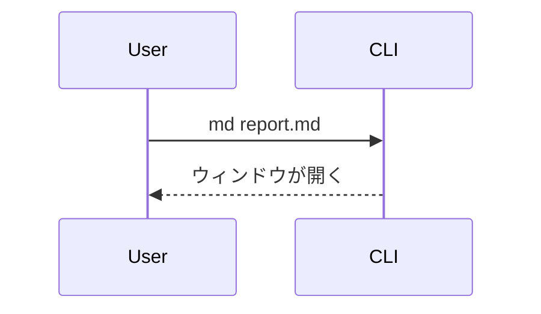

# md-preview チートシート

`md` コマンドで起動する macOS 向けの Markdown ビューア。GitHub 風の Markdown を WebKit ウィンドウで描画する。テーマ、検索（⌘F）、アウトライン（⌘T）、遅延ロードの図に対応している。

## 開き方

`md` は GUI ウィンドウを開き、閉じるまでブロックする。必ずバックグラウンドで起動する。

```bash
md path/to/document.md &
```

表示モードは開くパスで決まる:

- カレントディレクトリ内のファイル → フォルダモード（幅1200px、ディレクトリツリーのサイドバー付き）
- カレントディレクトリ外のファイル（一時ディレクトリなど） → 単一ファイルモード（900px、サイドバーなし）
- ディレクトリ（`md .` / `md docs/`） → そこをルートにしたフォルダモード

## 主なコマンド

```bash
md <file.md|ディレクトリ>   # ファイルかディレクトリを開く
cat file.md | md            # 標準入力（パイプ）から読む
md theme [<名前>]           # テーマ一覧の表示 / 切り替え
```

その他のオプション（`--sample`、`--version` など）は `md --help` を参照。

## 記法リファレンス

GFM（テーブル、タスクリスト、打ち消し線、脚注、シンタックスハイライト付きコード）に対応。加えて以下を描画する。

## テーブル

幅が広いテーブルの場合は横スクロール可能だが、各行を`### 見出し＋「列名: 値」`の箇条書きへ展開して、列の意味を保ったままスクロール不要にすると読みやすい。

### GFMアラート

アイコンつきの色分けコールアウトボックスになる。5種類は重大度順:

| 記法 | 用途 |
|---|---|
| `> [!NOTE]` | 軽い補足 |
| `> [!TIP]` | ちょっとした近道 |
| `> [!IMPORTANT]` | 頭に入れておくべきこと |
| `> [!WARNING]` | 間違えると実害が出る |
| `> [!CAUTION]` | データ損失など危険な操作 |

```markdown
> [!WARNING]
> これはテーブルを削除する。先にバックアップを取ること。
```

### Mermaid図

```` ```mermaid ```` のフェンスブロック。フローチャート、シーケンス図などに対応。遅延ロードなので、図のないドキュメントは軽いまま。

````markdown

````

### draw.io図

`<mxGraphModel>` または `<mxfile>` の XML を含む ```` ```drawio ```` ブロック。

### アコーディオン（折りたたみ）

標準の `<details>` / `<summary>` タグがそのまま使える。クリックで開閉する折りたたみUIになる。`</summary>` の後に**空行を1行**入れると、中身が通常のマークダウンとして解釈される。`<details open>` で初期状態を開いた状態にできる。

```markdown
<details>
<summary>クリックで開く見出し</summary>

ここに本文。**マークダウン**やリスト、コードブロックも書ける。

</details>
```

### ファイル名つきコードブロック

言語の後にパスを付けると、ブロックの上にファイル名ヘッダが描画される。

````markdown
```rust:src/main.rs
fn main() {}
```
````

### フロントマター

先頭の `--- key: value ---` ブロックが、上部に小さなメタ情報テーブルとして描画される（title、author、date など）。`key: value` を1行1つで書く。完全な YAML ではなく、ネスト構造は描画されない。
