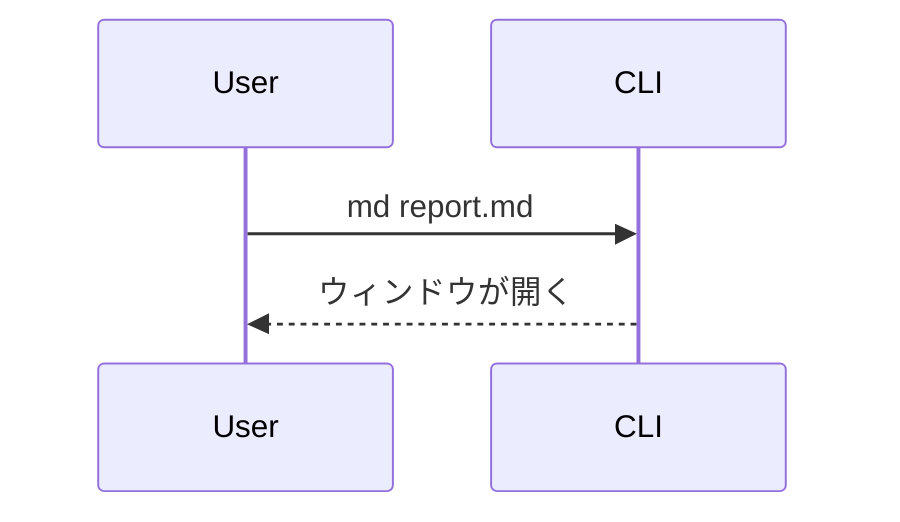

# 記法リファレンス

GFM（テーブル、タスクリスト、打ち消し線、脚注、シンタックスハイライト付きコード）に対応。
加えて以下を描画する。

## リンク

| 書き方 | 結果 |
|---|---|
| `<https://example.com>` | ✅ クリックできる（**推奨**） |
| `[表示文字](https://example.com)` | ✅ クリックできる |
| `https://example.com`（裸のURL） | ❌ ただのテキスト |
| `[[https://example.com]]` | ✅ クリックできる（WikiLink） |
| `[[https://example.com\|表示名]]` | ✅ 別名リンク（`\|` で表示文字を指定） |

URL をそのまま貼るときは `<https://example.com>` のように **山カッコで囲む**のがおすすめ。
裸のURLは自動リンク化されないので、そのままだと飛べない。`http`/`https` のリンクはクリックで
デフォルトブラウザが開く。同じディレクトリ内の相対リンク（`[次へ](./other.md)`）はプレビュー
ペイン内で遷移する。ファイルパスやスキーム無しの文字列はリンクにならない。

`[[...]]` の WikiLink 記法も使える。`[[https://example.com]]` や `[[https://example.com|表示名]]`
のように URL を入れるとリンクになる。中身がページ名（`[[SomePage]]`）の場合はそのまま相対パスへの
リンクになるため、実在するパスでないと遷移先は開けない。

## テーブル

幅が広いテーブルの場合は横スクロール可能だが、各行を `### 見出し＋「列名: 値」` の箇条書きへ
展開して、列の意味を保ったままスクロール不要にすると読みやすい。

## GFMアラート

アイコンつきの色分けコールアウトボックスになる。5種類は重大度順:

| 記法 | 用途 |
|---|---|
| `> [!NOTE]` | 軽い補足 |
| `> [!TIP]` | ちょっとした近道 |
| `> [!IMPORTANT]` | 頭に入れておくべきこと |
| `> [!WARNING]` | 間違えると実害が出る |
| `> [!CAUTION]` | データ損失など危険な操作 |

```markdown
> [!WARNING]
> これはテーブルを削除する。先にバックアップを取ること。
```

## Mermaid図

```` ```mermaid ```` のフェンスブロック。フローチャート、シーケンス図などに対応。遅延ロードなので、図のないドキュメントは軽いまま。

````markdown

````

## draw.io図

`<mxGraphModel>` または `<mxfile>` の XML を含む ```` ```drawio ```` ブロック。図をクリックすると全画面表示になり、ズーム・パンできる。Mermaid / draw.io のライブラリは図が含まれるときだけ遅延ロードされる。

## アコーディオン（折りたたみ）

標準の `<details>` / `<summary>` タグがそのまま使える。クリックで開閉する折りたたみUIになる。`</summary>` の後に**空行を1行**入れると、中身が通常のマークダウンとして解釈される。`<details open>` で初期状態を開いた状態にできる。

```markdown
<details>
<summary>クリックで開く見出し</summary>

ここに本文。**マークダウン**やリスト、コードブロックも書ける。

</details>
```

## ファイル名つきコードブロック

言語の後にパスを付けると、ブロックの上にファイル名ヘッダが描画される。

````markdown
```rust:src/main.rs
fn main() {}
```
````

## フロントマター

先頭の `--- key: value ---` ブロックが、上部に小さなメタ情報テーブルとして描画される（title、author、date など）。`key: value` を1行1つで書く。完全な YAML ではなく、ネスト構造は描画されない。
