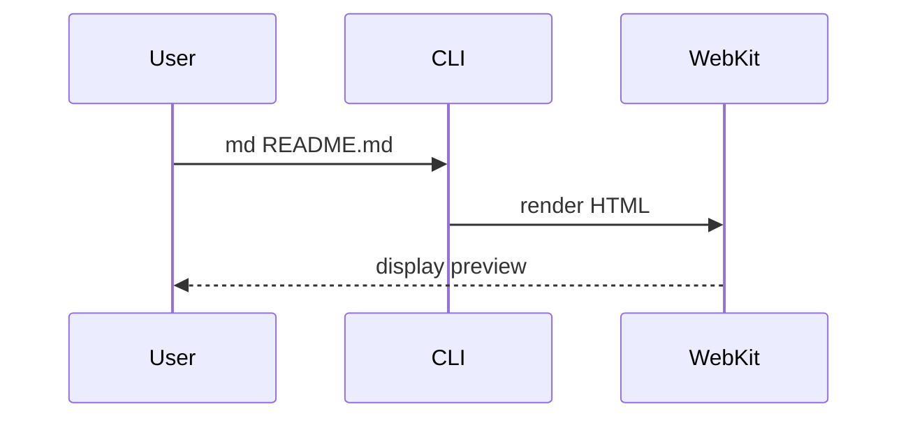
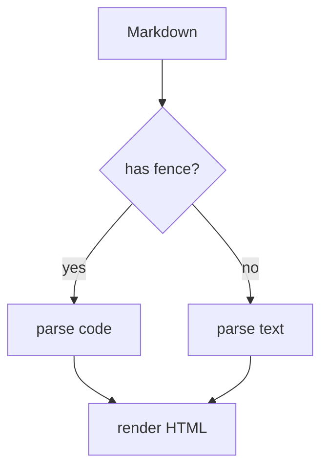

# 大見出し H1

これは導入の段落。新しいタイポグラフィでは行間 1.75、本文サイズ 17px、本文幅 720px に調整されている。長文を読み流したときに視線が迷わない密度を狙っている。

## 中見出し H2

長めの段落をもう一つ置いて、見出しと本文の呼吸感を確認する。`code spans` は地の文に馴染ませた淡色背景にしている。

### 小見出し H3

リンクは [GitHub](https://github.com/) のように青基調。

#### さらに小さく H4

---

## GFM Alerts

> [!NOTE]
> 補足情報。読者がスキミングしている時にも気付けるようにする。

> [!TIP]
> 物事をうまく進めるためのヒント。

> [!IMPORTANT]
> ユーザーの達成のために知っておくべき重要な情報。

> [!WARNING]
> 起こり得る問題を避けるための即座の注意。

> [!CAUTION]
> アクションの否定的な結果を伴うリスクや、特定の操作を行うべきでない理由について。

通常の引用も従来通り：

> これは普通のブロッククォート。地の文より少し色を落とした見た目。

---

## Mermaid

シーケンス図：



フローチャート：



---

## コードブロック

ファイル名なしの通常コードブロック（コピーボタンが右上に出る）：

```rust
fn main() {
    println!("Hello, md-preview!");
    let v = vec![1, 2, 3];
    for x in &v {
        println!("{}", x);
    }
}
```

ファイル名つきコードブロック `rust:src/main.rs`：

```rust:src/main.rs
use std::path::PathBuf;

pub fn open(path: PathBuf) -> std::io::Result<String> {
    std::fs::read_to_string(path)
}
```

別言語の例 `python:scripts/build.py`：

```python:scripts/build.py
def main():
    print("hello")

if __name__ == "__main__":
    main()
```

インラインコード `let x = 42;` も同居させて確認。

---

## テーブル

| 機能 | 状態 | 備考 |
|------|------|------|
| Mermaid | ✅ | バンドル済 |
| Callout | ✅ | GFM 5種 |
| Copy ボタン | ✅ | hover で表示 |
| タイポ刷新 | ✅ | 既定CSS更新 |

---

## リスト & タスク

- 項目1
- 項目2
  - ネスト
  - もうひとつ
- 項目3

タスク：

- [x] Mermaid 対応
- [x] Callout
- [x] コピーボタン
- [ ] さらに何か追加機能

---

## フットノート

これはフットノート例[^1]。複数も可能[^note2]。

[^1]: 一つ目の脚注。
[^note2]: 二つ目の脚注。
