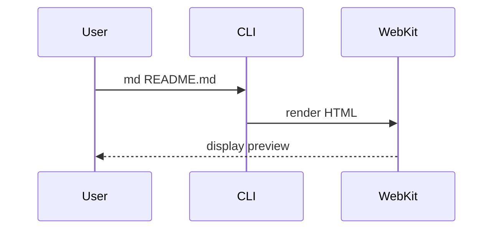
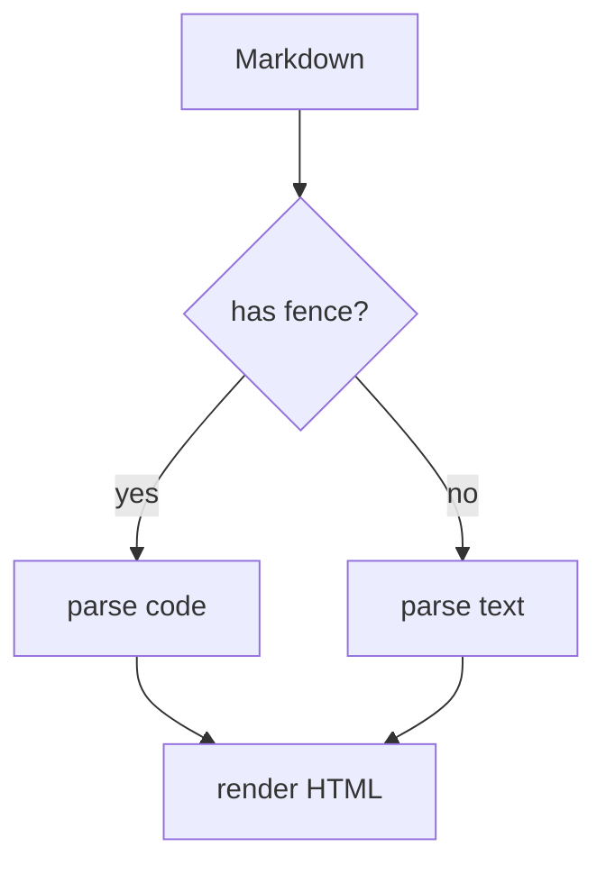

# 大見出し H1

これは導入の段落。新しいタイポグラフィでは行間 1.75、本文サイズ 17px、本文幅 720px に調整されている。長文を読み流したときに視線が迷わない密度を狙っている。

> [!TIP]
> `?` キーでキーボードショートカット一覧を表示できる（右クリックメニューからも開ける）。
> `j`/`k`・`d`/`u`・`Space`・`g`/`G` で less/vim 風にスクロール、`/` で検索（`⌘F` なら同じキーで閉じられる）。
> `⌃⌘F` で緑ボタンと同じフルスクリーン。フォルダを開いているときは
> `⌘P` でファイル名のあいまい検索から目的のファイルへ一発で飛べる（未入力なら git で変更のあるファイルが `+N −M` 付きで先頭に並ぶので、`⌘P` → `Enter` でいま触っているファイルへ飛べる）。
> `]`/`[` で次/前のファイルへ、`Tab` で本文とファイルツリーのフォーカスを切り替え（ツリー内は `j`/`k`・`Enter`/`l`・`h`）。
> `c` でコメントモードに入り、この段落や下の表・コードをクリック（複数行はドラッグ）して指摘を付け、サイドバー（コメントタブ）の「全部コピー」でまとめてコピーできる。マウス無しでも `j`/`k` でユニット移動・`Shift+j`/`k` でレンジ・`Enter` で付与できる。

## 中見出し H2

長めの段落をもう一つ置いて、見出しと本文の呼吸感を確認する。`code spans` は地の文に馴染ませた淡色背景にしている。

### 小見出し H3

リンクは [GitHub](https://github.com/) のように青基調。URL をそのまま貼るときは山カッコで囲むと飛べる → <https://github.com/>（裸の `https://github.com/` はテキストのまま）。WikiLink 記法 [[https://github.com/|GitHub（WikiLink）]] も使える。

#### さらに小さく H4

---

## GFM Alerts

> [!NOTE]
> 補足情報。読者がスキミングしている時にも気付けるようにする。

> [!TIP]
> 物事をうまく進めるためのヒント。

> [!IMPORTANT]
> ユーザーの達成のために知っておくべき重要な情報。

> [!WARNING]
> 起こり得る問題を避けるための即座の注意。

> [!CAUTION]
> アクションの否定的な結果を伴うリスクや、特定の操作を行うべきでない理由について。

通常の引用も従来通り：

> これは普通のブロッククォート。地の文より少し色を落とした見た目。

---

## アコーディオン

標準の `<details>` / `<summary>` タグがそのまま使える。クリックで開閉できる折りたたみUIになる。

<details>
<summary>クリックで開く</summary>

`</summary>` の後に**空行を1行**入れると、中身が普通のマークダウンとして解釈される。

- リストも
- 書ける

```rust
fn main() {}
```

</details>

<details open>
<summary>最初から開いておく（open 属性）</summary>

`<details open>` と書くと、初期状態で展開されている。

</details>

---

## Mermaid

シーケンス図：



フローチャート：



---

## draw.io

`drawio` 言語ブロックに draw.io の XML（`<mxGraphModel>` または `<mxfile>`）を貼ると図として描画される。ライブラリは図がある時だけ遅延ロードされる：

```drawio
<mxGraphModel dx="640" dy="480" grid="0" guides="1" tooltips="1" connect="1" arrows="1" fold="1" page="0" pageScale="1" math="0" shadow="0">
  <root>
    <mxCell id="0" />
    <mxCell id="1" parent="0" />
    <mxCell id="2" value="Markdown" style="rounded=1;whiteSpace=wrap;html=1;fillColor=#dae8fc;strokeColor=#6c8ebf;" vertex="1" parent="1">
      <mxGeometry x="40" y="80" width="120" height="50" as="geometry" />
    </mxCell>
    <mxCell id="3" value="md-preview" style="rounded=1;whiteSpace=wrap;html=1;fillColor=#d5e8d4;strokeColor=#82b366;" vertex="1" parent="1">
      <mxGeometry x="240" y="80" width="120" height="50" as="geometry" />
    </mxCell>
    <mxCell id="4" value="プレビュー" style="rounded=1;whiteSpace=wrap;html=1;fillColor=#ffe6cc;strokeColor=#d79b00;" vertex="1" parent="1">
      <mxGeometry x="440" y="80" width="120" height="50" as="geometry" />
    </mxCell>
    <mxCell id="5" style="edgeStyle=orthogonalEdgeStyle;rounded=1;html=1;" edge="1" parent="1" source="2" target="3">
      <mxGeometry relative="1" as="geometry" />
    </mxCell>
    <mxCell id="6" style="edgeStyle=orthogonalEdgeStyle;rounded=1;html=1;" edge="1" parent="1" source="3" target="4">
      <mxGeometry relative="1" as="geometry" />
    </mxCell>
  </root>
</mxGraphModel>
```

---

## コードブロック

ファイル名なしの通常コードブロック（コピーボタンが右上に出る）：

```rust
fn main() {
    println!("Hello, md-preview!");
    let v = vec![1, 2, 3];
    for x in &v {
        println!("{}", x);
    }
}
```

ファイル名つきコードブロック `rust:src/main.rs`：

```rust:src/main.rs
use std::path::PathBuf;

pub fn open(path: PathBuf) -> std::io::Result<String> {
    std::fs::read_to_string(path)
}
```

別言語の例 `python:scripts/build.py`：

```python:scripts/build.py
def main():
    print("hello")

if __name__ == "__main__":
    main()
```

インラインコード `let x = 42;` も同居させて確認。

---

## ファイルリンクのコード埋め込み

ローカルファイルへのリンクを**段落に単独で**置くと、そのファイルの中身がコードブロックとして展開される（GitHub のパーマリンク埋め込みのローカル版）。パスは、この md ファイルがある場所を基準に解決される。

行範囲を `#L10-L20` で指定：

[言語判定のテーブル](./request.rs#L82-L92)

1 行だけなら `#L5`：

[MD_OPTIONS の宣言](./html.rs#L111)

範囲を省略するとファイル全体（長いファイルは頭 400 行で打ち切り、ヘッダに総行数を出す）：

[エントリポイント](./lib.rs)

文中に置いたリンクは、これまで通り普通のリンクのまま → 本文中の [lib.rs](./lib.rs) は展開されない。外部 URL・見出しアンカー・読めないファイルも展開されず、リンクとして残る。

`.md` / `.html` への範囲なしのリンクは、ペイン内で遷移するナビゲーションなので埋め込まない（下は単独行だがリンクのまま）：

[README を開く](../README.md)

展開したいときは行範囲を付ける：

[README の冒頭](../README.md#L1-L6)

100 行を超える埋め込みは畳まれて先頭 40 行だけ出る。下端の「すべて表示」バーで開閉できる（1000 行がハード上限）：

[theme.rs 全体](./theme.rs)

---

## テーブル

| 機能 | 状態 | 備考 |
|------|------|------|
| Mermaid | ✅ | バンドル済 |
| Callout | ✅ | GFM 5種 |
| Copy ボタン | ✅ | hover で表示 |
| タイポ刷新 | ✅ | 既定CSS更新 |

---

## リスト & タスク

- 項目1
- 項目2
  - ネスト
  - もうひとつ
- 項目3

タスク：

- [x] Mermaid 対応
- [x] Callout
- [x] コピーボタン
- [ ] さらに何か追加機能

---

## フットノート

これはフットノート例[^1]。複数も可能[^note2]。

[^1]: 一つ目の脚注。
[^note2]: 二つ目の脚注。
