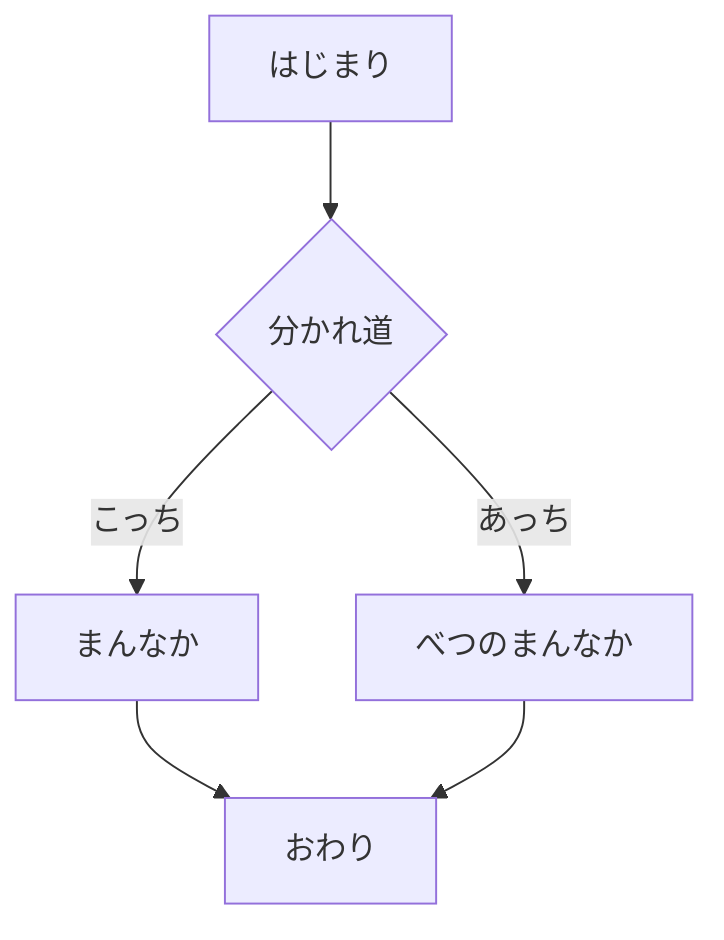
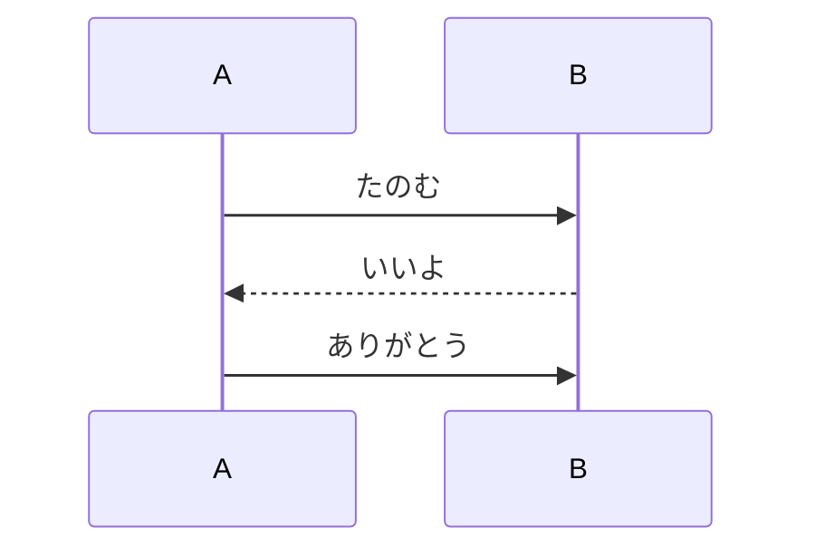

# 後から高さが変わる要素

mermaid は lib のロードと描画が終わるまで実寸を持たない。差し替えの直後に読み位置を
寄せた時点では未描画なので、そこから伸びたぶん読み位置が上へ抜ける。それが起きないことを
測るためのファイル。図はページの頭に置き、読む位置はその下に作る。

- 前半 1 行目の項目。図の下に高さを作る。
- 前半 2 行目の項目。図の下に高さを作る。
- 前半 3 行目の項目。図の下に高さを作る。
- 前半 4 行目の項目。図の下に高さを作る。
- 前半 5 行目の項目。図の下に高さを作る。
- 前半 6 行目の項目。図の下に高さを作る。
- 前半 7 行目の項目。図の下に高さを作る。
- 前半 8 行目の項目。図の下に高さを作る。
- 前半 9 行目の項目。図の下に高さを作る。
- 前半 10 行目の項目。図の下に高さを作る。
- 前半 11 行目の項目。図の下に高さを作る。
- 前半 12 行目の項目。図の下に高さを作る。
- 前半 13 行目の項目。図の下に高さを作る。
- 前半 14 行目の項目。図の下に高さを作る。
- 前半 15 行目の項目。図の下に高さを作る。
- 前半 16 行目の項目。図の下に高さを作る。
- 前半 17 行目の項目。図の下に高さを作る。
- 前半 18 行目の項目。図の下に高さを作る。
- 前半 19 行目の項目。図の下に高さを作る。
- 前半 20 行目の項目。図の下に高さを作る。
- 前半 21 行目の項目。図の下に高さを作る。
- 前半 22 行目の項目。図の下に高さを作る。
- 前半 23 行目の項目。図の下に高さを作る。
- 前半 24 行目の項目。図の下に高さを作る。
- 前半 25 行目の項目。図の下に高さを作る。
- 前半 26 行目の項目。図の下に高さを作る。
- 前半 27 行目の項目。図の下に高さを作る。
- 前半 28 行目の項目。図の下に高さを作る。
- 前半 29 行目の項目。図の下に高さを作る。
- 前半 30 行目の項目。図の下に高さを作る。
- 前半 31 行目の項目。図の下に高さを作る。
- 前半 32 行目の項目。図の下に高さを作る。
- 前半 33 行目の項目。図の下に高さを作る。
- 前半 34 行目の項目。図の下に高さを作る。
- 前半 35 行目の項目。図の下に高さを作る。
- 前半 36 行目の項目。図の下に高さを作る。
- 前半 37 行目の項目。図の下に高さを作る。
- 前半 38 行目の項目。図の下に高さを作る。
- 前半 39 行目の項目。図の下に高さを作る。
- 前半 40 行目の項目。図の下に高さを作る。
- 前半 41 行目の項目。図の下に高さを作る。
- 前半 42 行目の項目。図の下に高さを作る。
- 前半 43 行目の項目。図の下に高さを作る。
- 前半 44 行目の項目。図の下に高さを作る。
- 前半 45 行目の項目。図の下に高さを作る。
- 前半 46 行目の項目。図の下に高さを作る。
- 前半 47 行目の項目。図の下に高さを作る。
- 前半 48 行目の項目。図の下に高さを作る。
- 前半 49 行目の項目。図の下に高さを作る。
- 前半 50 行目の項目。図の下に高さを作る。
- 前半 51 行目の項目。図の下に高さを作る。
- 前半 52 行目の項目。図の下に高さを作る。
- 前半 53 行目の項目。図の下に高さを作る。
- 前半 54 行目の項目。図の下に高さを作る。
- 前半 55 行目の項目。図の下に高さを作る。
- 前半 56 行目の項目。図の下に高さを作る。
- 前半 57 行目の項目。図の下に高さを作る。
- 前半 58 行目の項目。図の下に高さを作る。
- 前半 59 行目の項目。図の下に高さを作る。
- 前半 60 行目の項目。図の下に高さを作る。

## 目印の見出し

直前は空行。ここを画面上端に置いて測る。

- 後半 1 行目の項目。見出しの下にも高さを作る。
- 後半 2 行目の項目。見出しの下にも高さを作る。
- 後半 3 行目の項目。見出しの下にも高さを作る。
- 後半 4 行目の項目。見出しの下にも高さを作る。
- 後半 5 行目の項目。見出しの下にも高さを作る。
- 後半 6 行目の項目。見出しの下にも高さを作る。
- 後半 7 行目の項目。見出しの下にも高さを作る。
- 後半 8 行目の項目。見出しの下にも高さを作る。
- 後半 9 行目の項目。見出しの下にも高さを作る。
- 後半 10 行目の項目。見出しの下にも高さを作る。
- 後半 11 行目の項目。見出しの下にも高さを作る。
- 後半 12 行目の項目。見出しの下にも高さを作る。
- 後半 13 行目の項目。見出しの下にも高さを作る。
- 後半 14 行目の項目。見出しの下にも高さを作る。
- 後半 15 行目の項目。見出しの下にも高さを作る。
- 後半 16 行目の項目。見出しの下にも高さを作る。
- 後半 17 行目の項目。見出しの下にも高さを作る。
- 後半 18 行目の項目。見出しの下にも高さを作る。
- 後半 19 行目の項目。見出しの下にも高さを作る。
- 後半 20 行目の項目。見出しの下にも高さを作る。
- 後半 21 行目の項目。見出しの下にも高さを作る。
- 後半 22 行目の項目。見出しの下にも高さを作る。
- 後半 23 行目の項目。見出しの下にも高さを作る。
- 後半 24 行目の項目。見出しの下にも高さを作る。
- 後半 25 行目の項目。見出しの下にも高さを作る。
- 後半 26 行目の項目。見出しの下にも高さを作る。
- 後半 27 行目の項目。見出しの下にも高さを作る。
- 後半 28 行目の項目。見出しの下にも高さを作る。
- 後半 29 行目の項目。見出しの下にも高さを作る。
- 後半 30 行目の項目。見出しの下にも高さを作る。
- 後半 31 行目の項目。見出しの下にも高さを作る。
- 後半 32 行目の項目。見出しの下にも高さを作る。
- 後半 33 行目の項目。見出しの下にも高さを作る。
- 後半 34 行目の項目。見出しの下にも高さを作る。
- 後半 35 行目の項目。見出しの下にも高さを作る。
- 後半 36 行目の項目。見出しの下にも高さを作る。
- 後半 37 行目の項目。見出しの下にも高さを作る。
- 後半 38 行目の項目。見出しの下にも高さを作る。
- 後半 39 行目の項目。見出しの下にも高さを作る。
- 後半 40 行目の項目。見出しの下にも高さを作る。
- 後半 41 行目の項目。見出しの下にも高さを作る。
- 後半 42 行目の項目。見出しの下にも高さを作る。
- 後半 43 行目の項目。見出しの下にも高さを作る。
- 後半 44 行目の項目。見出しの下にも高さを作る。
- 後半 45 行目の項目。見出しの下にも高さを作る。
- 後半 46 行目の項目。見出しの下にも高さを作る。
- 後半 47 行目の項目。見出しの下にも高さを作る。
- 後半 48 行目の項目。見出しの下にも高さを作る。
- 後半 49 行目の項目。見出しの下にも高さを作る。
- 後半 50 行目の項目。見出しの下にも高さを作る。
- 後半 51 行目の項目。見出しの下にも高さを作る。
- 後半 52 行目の項目。見出しの下にも高さを作る。
- 後半 53 行目の項目。見出しの下にも高さを作る。
- 後半 54 行目の項目。見出しの下にも高さを作る。
- 後半 55 行目の項目。見出しの下にも高さを作る。
- 後半 56 行目の項目。見出しの下にも高さを作る。
- 後半 57 行目の項目。見出しの下にも高さを作る。
- 後半 58 行目の項目。見出しの下にも高さを作る。
- 後半 59 行目の項目。見出しの下にも高さを作る。
- 後半 60 行目の項目。見出しの下にも高さを作る。
- 後半 61 行目の項目。見出しの下にも高さを作る。
- 後半 62 行目の項目。見出しの下にも高さを作る。
- 後半 63 行目の項目。見出しの下にも高さを作る。
- 後半 64 行目の項目。見出しの下にも高さを作る。
- 後半 65 行目の項目。見出しの下にも高さを作る。
- 後半 66 行目の項目。見出しの下にも高さを作る。
- 後半 67 行目の項目。見出しの下にも高さを作る。
- 後半 68 行目の項目。見出しの下にも高さを作る。
- 後半 69 行目の項目。見出しの下にも高さを作る。
- 後半 70 行目の項目。見出しの下にも高さを作る。
- 後半 71 行目の項目。見出しの下にも高さを作る。
- 後半 72 行目の項目。見出しの下にも高さを作る。
- 後半 73 行目の項目。見出しの下にも高さを作る。
- 後半 74 行目の項目。見出しの下にも高さを作る。
- 後半 75 行目の項目。見出しの下にも高さを作る。
- 後半 76 行目の項目。見出しの下にも高さを作る。
- 後半 77 行目の項目。見出しの下にも高さを作る。
- 後半 78 行目の項目。見出しの下にも高さを作る。
- 後半 79 行目の項目。見出しの下にも高さを作る。
- 後半 80 行目の項目。見出しの下にも高さを作る。
